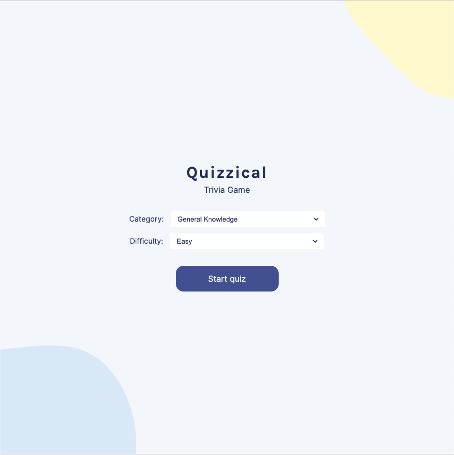
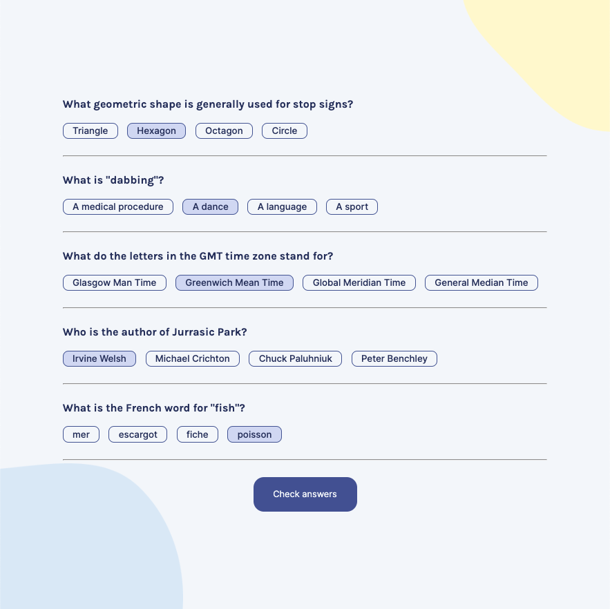
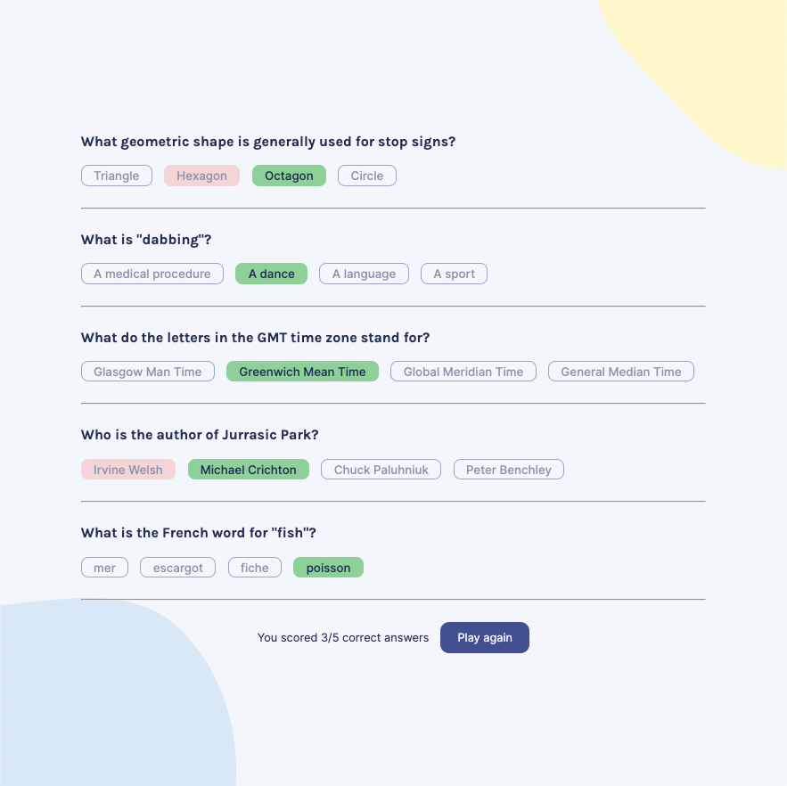

# Quizzical

A solo project from the [Scrimba Frontend Developer Career Path](https://scrimba.com/learn/frontend)

## Table of Contents

- [Overview](#overview)
  - [Requirements](#requirements)
  - [Screenshots](#screenshots)
  - [Links](#links)
  - [Built with](#built-with)

## Overview

### Requirements

- [x] Two screens (start & questions)
- [x] Pull 5 questions from the OTDB API
- [x] Tally correct answers after "check answers" is clicked
- [x] Styled & polished

### Screenshot

### Links

- Live Site URL: [GitHub Pages](https://xchristinawu.github.io/quizzical/)

### Built with

- HTML, CSS, JavaScript, React
